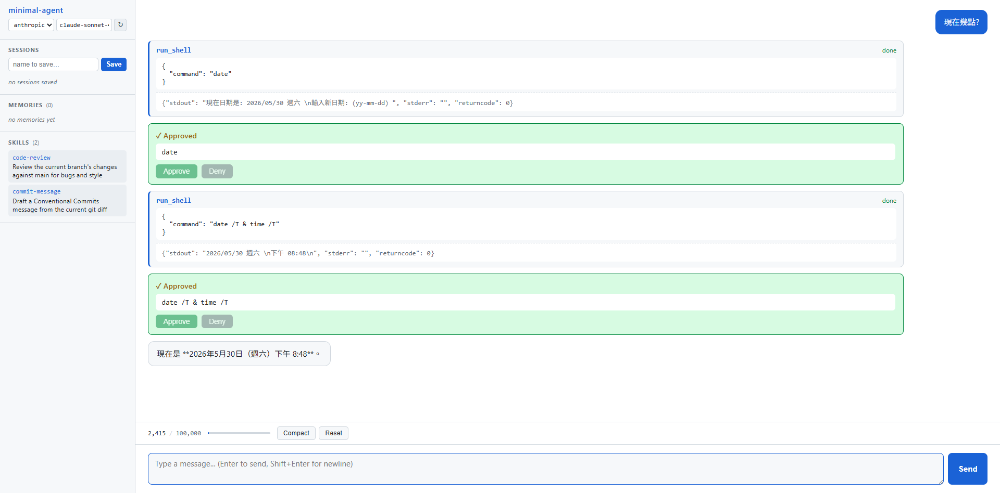

**English** | [中文](README.zh-TW.md)

# minimal-agent

A from-scratch AI agent loop (single-file Python core) + two optional extensions: peer-to-peer multi-agent group chat, and a FastAPI + SSE browser Web UI. Swap LLM provider (Anthropic Claude / OpenAI GPT) + tool use / function calling + MCP + RAG long-term memory + sub-agent delegation + lifecycle hooks + skills. No LangChain, LlamaIndex, AutoGen, or similar frameworks.

---

## What it is

One file (`minimal_agent.py`) does all this:

- Runs the LLM tool-use loop (request → tool call → tool result → loop)
- LLM provider abstraction: `--provider {anthropic,openai}` swaps with one flag, the Agent main loop is provider-agnostic
- Streams assistant messages token-by-token to stdout (both providers supported)
- 7 native tools: `run_shell` / `read_file` / `write_file` / `remember` / `recall` / `spawn_agent` / `load_skill`
- Hooks up an MCP server (`mcp-server-fetch`), mixes its tools with the native ones for the model
- Conversation persistence (JSON-serialized, resumable across sessions, loadable across providers)
- Context management: token counting, auto-trim (rolling summary), manual `/compact`
- Long-term memory: Voyage AI embedding + JSONL append-only + cosine similarity retrieval
- Sub-agent delegation: `spawn_agent` tool, depth limit ≤ 2, context isolation (provider auto-inherited)
- 7 lifecycle events for external hooks to register (`user_message`, `pre/post_turn`, `text_chunk`, `pre/post_tool`, `assistant_message`)
- Skills (`skills/<name>/SKILL.md`): scanned at startup, only name+description injected into the system prompt; the model decides when to `load_skill` to pull the full instructions

---

## Quickstart

```bash
pip install anthropic python-dotenv mcp mcp-server-fetch voyageai
# For the OpenAI provider, also:
pip install openai tiktoken
# For the Web UI, also:
pip install fastapi uvicorn
```

Create `.env`:

```
ANTHROPIC_API_KEY=sk-ant-...
OPENAI_API_KEY=sk-...     # only needed with --provider openai
VOYAGE_API_KEY=...        # only needed for remember / recall
```

Run (default Anthropic):

```bash
python minimal_agent.py
```

Switch to OpenAI:

```bash
python minimal_agent.py --provider openai           # defaults to gpt-5.5
python minimal_agent.py --provider openai --model gpt-4.1   # override model
```

```
you> what's in the current directory?
claude> Let me check with ls.
  [native tool] run_shell({'command': 'ls'})
  [shell] Approve this command?
    > ls
    [y]es / [n]o / [a]lways (this session) > y
  [tool result] memory  minimal_agent.py  sessions  skills ...
claude> 5 items: ...
[tokens: 2341]
```

---

## CLI flags

| Flag | What it does |
|------|------|
| `--provider {anthropic,openai}` | Pick LLM provider (default: anthropic) |
| `--model <name>` | Override the provider's default model (anthropic=`claude-sonnet-4-6`, openai=`gpt-5.5`) |
| `--resume <name>` | Load the named conversation session at startup |
| `--max-input-tokens N` | Auto-trim when input tokens exceed this (default 100k) |
| `--keep-recent-turns N` | Keep N most recent turns uncompressed during trim (default 5) |
| `--system-file <path>` | Use file contents as the system prompt |
| `--no-system` | Disable the system prompt entirely |
| `--approval {auto,ask,safe}` | `run_shell` approval mode: full auto / ask every time / read-only allowlist auto |
| `--yolo` | Shortcut for `--approval auto` |
| `--trace` | Print every lifecycle event (hooks demo / debug) |

---

## REPL slash commands

| Command | What it does |
|---------|------|
| `/save <name>` | Save the current conversation to `sessions/<name>.json` |
| `/load <name>` | Load a session and replace the current one |
| `/list` | List all saved sessions |
| `/messages` | Print a per-message summary of conversation history |
| `/tokens` | Show current input token usage vs the limit |
| `/compact` | Manually summarize the whole history into one recap |
| `/memories` | List everything in long-term memory |
| `/skills` | List name + description for every skill in `skills/` |
| `/system` | Print the current system prompt |
| `/reset` | Clear conversation history |
| `/exit` | Exit |

---

## Peer-to-peer multi-agent: `group_chat.py`

Optional demo built on top of `minimal_agent.py`. N stateful Agents take turns speaking and reviewing each other; `[DONE]` sentinel + max_rounds for two-layer termination. The demo runs planner + coder + reviewer, catching bugs a single agent reviewing its own work would miss.

```bash
python group_chat.py "Write a Python fib(n) function plus a quick test."
```

---

## Web UI: `web/`



Optional browser interface built on top of `minimal_agent.py`. FastAPI + native HTML/JS (no React, no build step).

```bash
pip install fastapi uvicorn
uvicorn web.server:app --reload
# open http://localhost:8000
```

---

## Project structure

```
minimal_agent.py    # Core agent loop, all single-agent logic lives here
group_chat.py       # Peer-to-peer multi-agent demo (built on minimal_agent.py, core untouched)
web/                # Optional Web UI (FastAPI + native HTML/JS)
skills/             # One subdirectory per skill, each with SKILL.md (frontmatter + instructions)
sessions/           # Saved conversations (gitignored)
memory/store.jsonl  # Long-term memory append-only file (gitignored)
README.md           # You're reading this (English)
README.zh-TW.md     # 中文版
```

---

## Commit progression

How to read the codebase: `git checkout c1e9a04` for the simplest version (~80 lines), then walk forward through `git log --oneline` diffs.

| Commit | What it adds |
|--------|---------|
| `9729fa0` | Initial version: minimal loop + mock `get_weather` tool |
| `c1e9a04` | Replace the mock with real `run_shell` / `read_file` / `write_file` |
| `8865be0` | Integrate MCP server, mix with native tools |
| `c18459c` | Refactor into `Agent` class + multi-turn REPL |
| `cc5718f` | Context management (`/tokens` `/compact` `/messages` + rolling summary auto-trim) |
| `8eac59c` | Conversation persistence (`/save` `/load` `--resume`) |
| `d3528ad` | Long-term memory via Voyage embedding (`remember` / `recall`) |
| `bffa463` | Token-by-token streaming output |
| `2772931` | Default system prompt + `--system-file` / `--no-system` |
| `5c37d9a` | `run_shell` approval prompt, three modes (auto/ask/safe) |
| `42d603a` | Sub-agent delegation (`spawn_agent` tool, depth limit) |
| `d7d28d6` | Lifecycle hooks (`Agent.on`, `--trace` demo flag) |
| `e3a9fa8` | Skills (`skills/<name>/SKILL.md` + `load_skill` tool + `/skills` command) |
| `0824aa0` | LLM provider abstraction (`--provider {anthropic,openai}` + Anthropic-canonical message format + OpenAI via `/v1/responses` API + reasoning model handling) |
| `abd1732` | Peer-to-peer multi-agent demo (`group_chat.py`: planner + coder + reviewer, N-1 sliding-window broadcast, `[DONE]` sentinel termination, removed `spawn_agent` + `remember` to prevent group-chat collapse, strict PLANNER_PROMPT to prevent reviewer cosplay) |
| `d4926f4` | Web UI commit 1: FastAPI + `POST /api/chat` + native HTML/JS single page, non-streaming — see the full reply at once |
| `1f8b49f` | Web UI commit 2: SSE streaming + async LLM SDK upgrade (new `text_chunk` lifecycle hook, `POST /api/chat` → request_id, `GET /api/stream` → EventSource, token-by-token display; `Anthropic` / `OpenAI` SDKs swapped for `AsyncAnthropic` / `AsyncOpenAI` so streaming is genuinely non-blocking) |
| `d7ee5e7` | Web UI commit 3: tool call cards + `run_shell` approval flow (`pre_tool` / `post_tool` hooks → tool_start / tool_end SSE events; `WebAgent` overrides `_approve_run_shell` → SSE + Future + `POST /api/approve` buttons) |
| `8586f56` | Web UI commit 4: sidebar (sessions / memories / skills lists) + token meter + Reset / Compact buttons + REPL-command-to-endpoint parity (`GET /api/state`, `POST /api/reset|compact`, `/api/sessions` CRUD, `GET /api/memories|skills`) |
| `4dc6c9e` | Web UI commit 5: provider/model hot-swap dropdown (`GET /api/providers`, `POST /api/provider`); canonical message format lets you switch Anthropic ↔ OpenAI mid-conversation without losing history. |

---

## Who it's for

- You already know basic Python
- You want to understand what LangChain / LlamaIndex / AutoGen are actually doing underneath
- You want to write your own agent without memorizing a framework's API
- You want to understand the common core architecture behind Claude Code, Cursor, ChatGPT plugins

---

It's the **smallest usable learning version**: it runs, it's enough to understand every concept.
